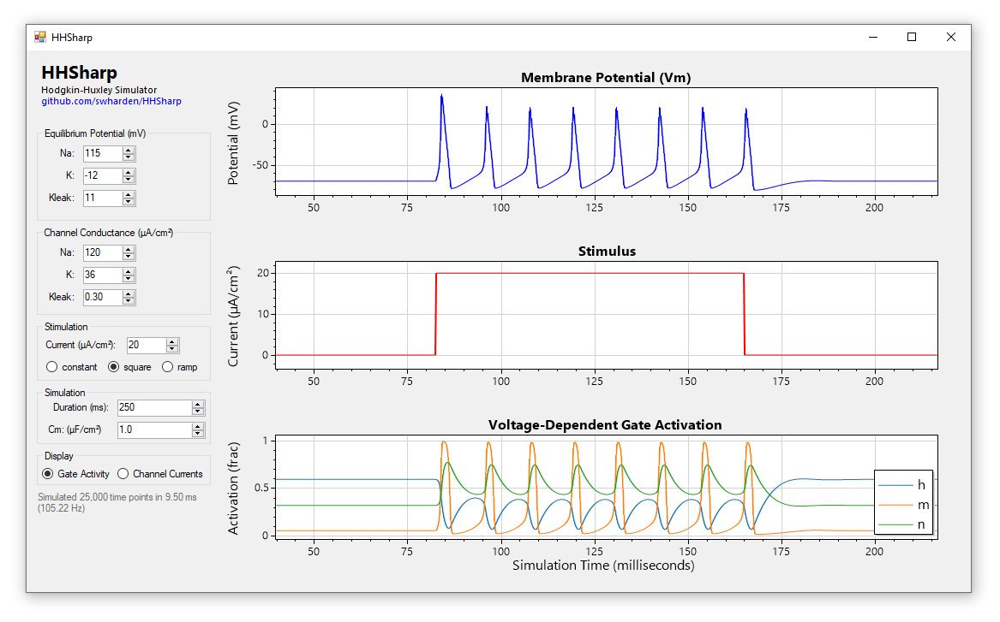
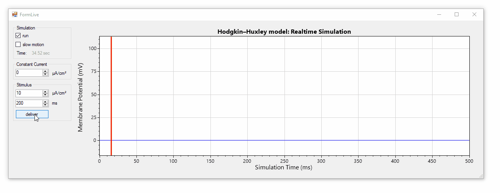

# HHSharp

**HHSharp is an interactive Hodgkin-Huxley neuron simulator**. The neuron model and simulation code ([HHModel.cs](src/HHSharp/HHModel.cs)) contains fewer than 100 lines and was written in C# using an object-oriented coding style. Code comments even cite specific equations from Hodgkin and Huxley's 1952 manuscript.

HHSharp uses a simulation model which calculates channel conductances and membrane potential at discrete time points eliminating the need for a differential equation solver and allowing the model cell to be challenged with complex stimuluation waveforms. [ScottPlot](https://github.com/swharden/ScottPlot) is used to interactively display simulation results.

### Download
* Click-to-run EXE: **[HHSharp.zip](/download/HHSharp.zip)**
* Source code is in: **[src/](/src/)**

## Simulating the Hodgkin–Huxley Model in Software

### Action Potentials in Neural Membranes
Action potentials are self-propagating voltage fluctuations that occur as voltage-gated ion channels open and close. The Hodgkin–Huxley model describes 3 ion channels, two of which contain voltage-dependent gates:
* **Voltage-gated Na⁺ channel** with 2 voltage-dependent gates (`m` and `h`)
* **Voltage-gated K⁺ channel** with 1 voltage-dependent gate (`n`)
* **K⁺ leak channel** with no gate

Voltage-gated channel conductances are dependent on gate activity. Gate activity is dependent on voltage and time. Gates open and close exponentially with time-constants (`alpha` and `beta`) which depend on voltage. Voltage is a function of the sum of channel currents and is influenced by capacitance. 

Although we can define each of these items as an individual equation, together these equations depend on each other (making them a set of _differential equations_). The Hodgkin–Huxley model uses a set of four differential equations to describe voltage of a neuron, and we can simulate these equations in software to produce a neuron model which fires action potentials.

### Simulating the _active_ component of neurons

Voltage-dependent ion channel gates don't open or close instantaneously, but rather slowly open and slowly close. Further, different gates open and close at different speeds. It's this phenomenon that is primarily responsible for the generation of action potentials: the excitatory voltage-gated sodium channel activation gate (`m`) is faster to activate than the inhibitory voltage-gated potassium channel activation gate (`n`) or the voltage-gated sodium channel inactivation gate (`h`), resulting the initial rise in voltage. As the original excitatory gate (`m`) becomes deactivated and two inhibitory gates (`n` and `h`) are activated, the potassium currents dominate and the cell begins to become more negative. 

Our goal in software is to know how much current every channel is passing at each time point. This means calculating the _activation state_ of each gate. Gate activation can be modeled using equations from the Hodgkin–Huxley publication which describe the opening and closing forces (as `beta` and `alpha`) which depend on time and membrane voltage. In code we handle these operations by creating an abstract `VoltageGate` class which has `alpha`, `beta`, and `activation` properties and a few helper methods ([HHModel.cs#L5-L15](https://github.com/swharden/HHSharp/blob/7967a0c935bf7734f95562b5fe6263b724ab6582/src/HHSharp/HHModel.cs#L5-L15)). To model the different kinetics of `m`, `m`, and `n` gates we create 3 new classes which inherit from `VoltageGate` but implement unique `UpdateTimeConstants()` functions ([HHModel.cs#L17-L42](https://github.com/swharden/HHSharp/blob/7967a0c935bf7734f95562b5fe6263b724ab6582/src/HHSharp/HHModel.cs#L17-L42)) based on Hodgkin & Huxley's 1952 manuscript.

### Simulating the _passive_ component of neurons

After the 3 gates are modeled in software, we can determine the conductance of voltage-gated Na⁺ and K⁺ channels and assume a constant conductance of Kleak channels. By combining these 3 channel conductances with the present membrane voltage and equilibrium potential for Na⁺ and K⁺ we can calculate the channel currents. By summing all channel currents together, we can calculate the total neuron membrane current. When combined with cell capacitance (Cm), we can calculate the change in voltage over a small step in time ([HHModel.cs#L76-L83](https://github.com/swharden/HHSharp/blob/7967a0c935bf7734f95562b5fe6263b724ab6582/src/HHSharp/HHModel.cs#L76-L83)). 

With this new voltage in-hand we can start over and calculate the voltage-gated channel gate states which are slightly different now because voltage has changed. By iterating this process (typically in 0.01 ms steps) we can simulate the membrane voltage as time passes ([HHModel.cs#L85-L92](https://github.com/swharden/HHSharp/blob/7967a0c935bf7734f95562b5fe6263b724ab6582/src/HHSharp/HHModel.cs#L85-L92)).

### Additional Resources
* [pyHH](https://github.com/swharden/pyHH) is a similar project for Python
* [Hodgkin and Huxley, 1952](https://www.ncbi.nlm.nih.gov/pmc/articles/PMC1392413/pdf/jphysiol01442-0106.pdf) (the original manuscript)
* [The Hodgkin-Huxley Mode](http://www.genesis-sim.org/GENESIS/iBoG/iBoGpdf/chapt4.pdf) (The GENESIS Simulator, Chapter 4)
* Wikipedia: [Hodgkin–Huxley model](https://en.wikipedia.org/wiki/Hodgkin%E2%80%93Huxley_model)
* [Summary of the Hodgkin-Huxley model](http://ecee.colorado.edu/~ecen4831/HHsumWWW/HHsum.html) by Dave Beeman
